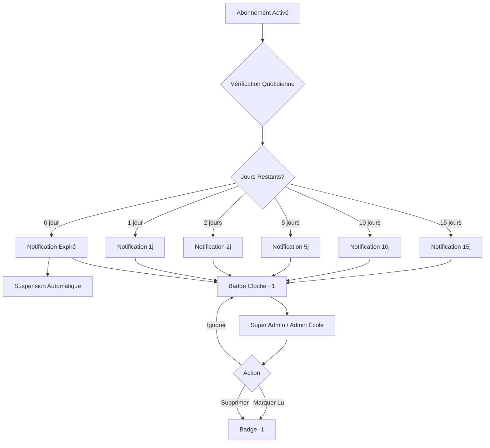

# Système de Notifications d'Abonnement

## 📋 Vue d'ensemble

Ce système génère automatiquement des notifications d'alerte pour les abonnements qui arrivent à expiration. Il permet au Super Admin et aux administrateurs d'école d'être informés en temps réel de l'état des abonnements.

## 🔔 Fonctionnalités

### Alertes Automatiques

Le système envoie des notifications aux moments suivants :
- **15 jours** avant l'expiration
- **10 jours** avant l'expiration  
- **5 jours** avant l'expiration
- **2 jours** avant l'expiration
- **1 jour** avant l'expiration
- **Le jour de l'expiration** (abonnement expiré)

### Messages Différenciés

#### Pour le Super Admin
- `🔔 L'abonnement de l'école "Nom École" expire dans X jours.`
- `🔔 Attention ! L'abonnement de l'école "Nom École" expire dans 1 jour.`
- `⚠️ L'abonnement de l'école "Nom École" a expiré. Suspension automatique du compte.`

#### Pour les Administrateurs d'École
- `🔔 Votre abonnement expire dans X jours. N'oubliez pas de le renouveler pour continuer à utiliser nos services.`
- `🔔 Attention ! Votre abonnement expire dans 1 jour. Pensez à le renouveler pour éviter une interruption de service.`
- `⚠️ Votre abonnement a expiré. Votre compte a été suspendu. Veuillez contacter l'administration pour renouveler.`

### Suspension Automatique

Lorsqu'un abonnement expire, le système :
1. Crée une notification d'expiration
2. Change automatiquement le statut de l'école de `ACTIF` à `SUSPENDU`
3. Alerte le Super Admin et les administrateurs de l'école

## 🎯 Composants

### 1. Modèle de Données (Prisma)

```prisma
model Notification {
  id        Int      @id @default(autoincrement())
  type      NotificationType
  message   String   @db.Text
  schoolId  Int?
  userId    Int?
  isRead    Boolean  @default(false)
  daysLeft  Int?
  createdAt DateTime @default(now())
}

enum NotificationType {
  SUBSCRIPTION_EXPIRING_15_DAYS
  SUBSCRIPTION_EXPIRING_10_DAYS
  SUBSCRIPTION_EXPIRING_5_DAYS
  SUBSCRIPTION_EXPIRING_2_DAYS
  SUBSCRIPTION_EXPIRING_1_DAY
  SUBSCRIPTION_EXPIRED
}
```

### 2. API Routes

#### `GET /api/notifications`
Récupère toutes les notifications de l'utilisateur connecté.
- Super Admin : voit toutes les notifications
- Autres utilisateurs : voient uniquement leurs notifications

#### `GET /api/notifications/count`
Retourne le nombre de notifications non lues.

#### `PATCH /api/notifications/[id]`
Marque une notification comme lue.

#### `DELETE /api/notifications/[id]`
Supprime une notification.

#### `POST /api/notifications`
Marque toutes les notifications comme lues.

#### `POST /api/notifications/check`
**Réservé au Super Admin**  
Déclenche manuellement la vérification des abonnements et la génération des notifications.

#### `GET /api/notifications/check`
**Pour Cron Jobs**  
Nécessite un header `Authorization: Bearer CRON_SECRET` pour l'authentification.

### 3. Composant React

#### `NotificationBell`

Composant UI complet avec :
- **Badge** : Affiche le nombre de notifications non lues
- **Animation** : La cloche pulse et le badge rebondit quand il y a des notifications
- **Panneau déroulant** : Liste de toutes les notifications avec :
  - Icônes colorées selon l'urgence
  - Dates formatées (relative)
  - Boutons d'action (marquer lu, supprimer)
  - Bouton "Tout marquer lu"

**Couleurs des notifications** :
- 🔴 Rouge : Expiré
- 🟠 Orange : 1-2 jours restants
- 🟡 Jaune : 5 jours restants
- 🔵 Bleu : 10-15 jours restants

## 🚀 Utilisation

### Pour le Super Admin

1. **Vérification Manuelle**  
   Dans l'onglet "Schools", cliquez sur le bouton **"Vérifier Notifications"** pour déclencher une vérification immédiate.

2. **Vérification Automatique**  
   Le composant `NotificationBell` vérifie automatiquement les notifications non lues toutes les **5 minutes**.

3. **Voir les Notifications**  
   Cliquez sur l'icône de cloche dans le header. Le badge affiche le nombre de notifications non lues.

4. **Actions sur les Notifications**  
   - Cliquer sur ✓ : marquer comme lue
   - Cliquer sur ✗ : supprimer
   - "Tout marquer lu" : marquer toutes comme lues

### Pour les Administrateurs d'École

1. Les notifications apparaissent automatiquement dans la cloche du header
2. Elles sont filtrées pour afficher uniquement les notifications de leur école
3. Ils reçoivent des alertes personnalisées selon les mêmes seuils (15, 10, 5, 2, 1 jours, expiration)

## ⚙️ Configuration

### Variables d'Environnement

Ajoutez dans votre fichier `.env` :

```env
JWT_SECRET=your-secret-key
CRON_SECRET=your-cron-secret  # Pour les tâches automatiques
```

### Cron Job (Production)

Pour automatiser la vérification des notifications en production, configurez un cron job qui appelle :

```bash
curl -X GET https://votre-domaine.com/api/notifications/check \
  -H "Authorization: Bearer your-cron-secret"
```

**Fréquence recommandée** : Une fois par jour à minuit

Exemple de configuration cron (Vercel Cron, AWS EventBridge, etc.) :
```
0 0 * * * # Tous les jours à minuit
```

## 📊 Workflow Complet



## 🎨 Interface Utilisateur

### Badge de Notification
- Affiche le nombre de notifications non lues
- Limite d'affichage : "99+" pour les nombres > 99
- Animation : Rebondissement pour attirer l'attention

### Panneau de Notifications
- **Largeur** : 384px (w-96)
- **Hauteur max** : 600px avec scroll
- **Header** : Gradient indigo-purple
- **Notifications** :
  - Non lues : Fond bleu foncé (indigo-900/20)
  - Lues : Fond transparent
  - Survol : Fond gris (gray-700/50)

### Code Couleur
- **Rouge** (text-red-400) : Expiré
- **Orange** (text-orange-400) : 1-2 jours
- **Jaune** (text-yellow-400) : 5 jours
- **Bleu** (text-blue-400) : 10-15 jours

## 🔒 Sécurité

- Authentification JWT requise pour toutes les routes
- Super Admin : accès complet
- Admins d'école : accès restreint à leurs notifications
- Cron jobs : authentification via secret dédié

## 🐛 Debug

Pour tester le système :

1. Créer une école avec abonnement actif
2. Modifier manuellement la `dateFinAbonnement` dans la base de données pour simuler différents scénarios
3. Cliquer sur "Vérifier Notifications" dans l'onglet Schools
4. Vérifier la cloche pour voir les notifications générées

```sql
-- Exemple : Mettre une date d'expiration dans 5 jours
UPDATE School 
SET dateFinAbonnement = DATE_ADD(NOW(), INTERVAL 5 DAY)
WHERE id = 1;
```

## 📝 Notes Importantes

1. **Doublons** : Le système vérifie qu'une notification du même type n'a pas déjà été créée dans les dernières 24h
2. **Performance** : Les index sur `userId`, `schoolId`, `isRead` et `createdAt` optimisent les requêtes
3. **Limitation** : Pour l'instant, les admins d'école reçoivent les notifications via `creeParId` (créateur de l'école)
4. **TODO** : Associer explicitement les admins aux écoles dans le schéma pour une meilleure gestion des permissions

## 🎉 Résultat Final

- ✅ Notifications automatiques à intervalles précis (15, 10, 5, 2, 1 jours, expiration)
- ✅ Messages différenciés Super Admin vs Admins d'école
- ✅ Badge avec compteur en temps réel
- ✅ Interface intuitive avec actions rapides
- ✅ Suspension automatique des comptes expirés
- ✅ Vérification périodique automatique (5 minutes)
- ✅ Système de couleurs pour identifier l'urgence
- ✅ Support Cron pour automatisation en production
